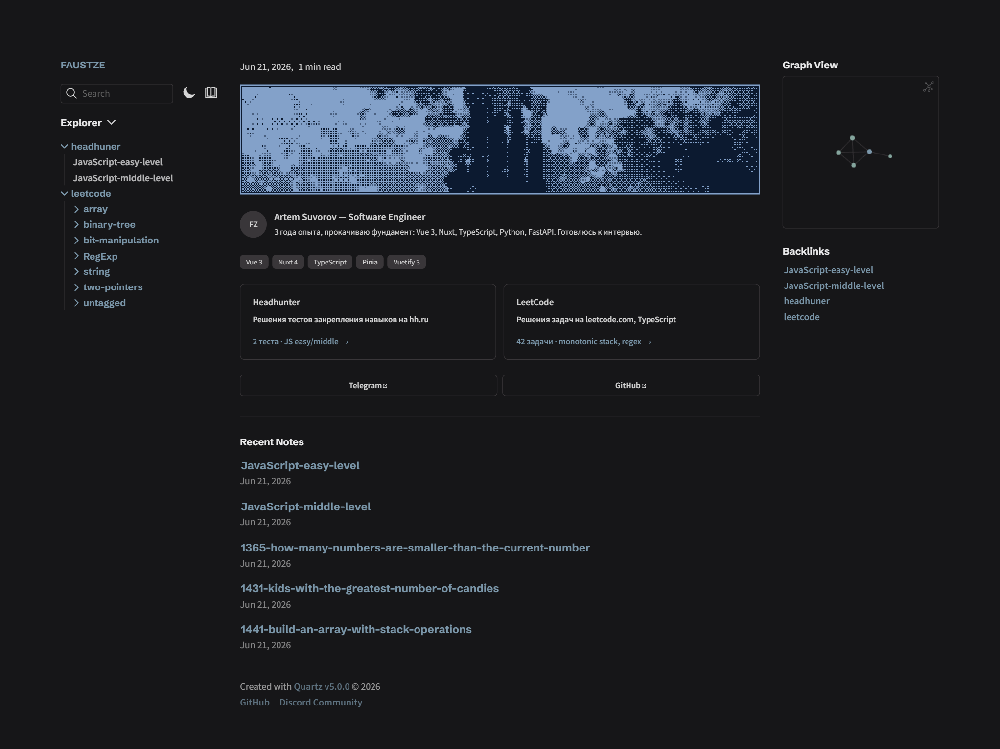

<div align="center">

# 🌱 Notes — Digital Garden

[](https://github.com/faustze/notes/commits)
[](https://notes.faustze.tech)
[](https://quartz.jzhao.xyz/)

[](https://notes.faustze.tech)

</div>

---

## 🎯 Goal

Solving LeetCode problems in TypeScript, completing hh.ru skill assessments along the way.

---

## 📚 Content

| Section           | Progress    | Topics                           |
| ----------------- | ----------- | -------------------------------- |
| 🏢 **HeadHunter** | 12 tests    | JS Easy, JS Middle               |
| 💻 **LeetCode**   | 47 problems | Arrays, Strings, Monotonic Stack |

---

## 🛠 Tech Stack

| Tool                                   | Purpose                                   |
| -------------------------------------- | ----------------------------------------- |
| [Quartz v5](https://quartz.jzhao.xyz/) | Static site generator for digital gardens |
| Markdown + Obsidian                    | Content authoring format                  |
| GitHub Pages                           | Hosting                                   |

---

## 🚀 Local Development

```bash
npm install
npx quartz build --serve
```

Then open [http://localhost:8080](http://localhost:8080)

---

## 🔗 Links

|                 |                                                          |
| --------------- | -------------------------------------------------------- |
| 🌐 **Discord**  | [discord.gg/bXbwU3xS](https://discord.gg/bXbwU3xS)       |
| 📢 **Telegram** | [t.me/faustflow](https://t.me/faustflow)                 |
| 👾 **Twitch**   | [twitch.tv/faustze](https://www.twitch.tv/faustze/about) |

---

## 📄 License

Based on [Quartz](https://github.com/jackyzha0/quartz) by [@jackyzha0](https://github.com/jackyzha0), licensed under [MIT](./LICENSE.txt).
